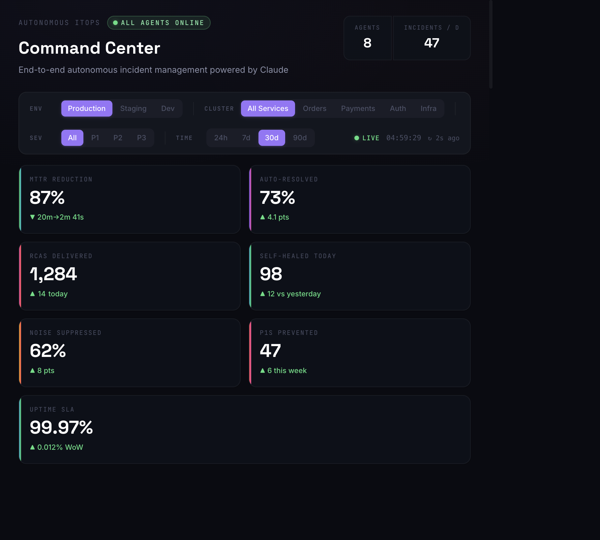
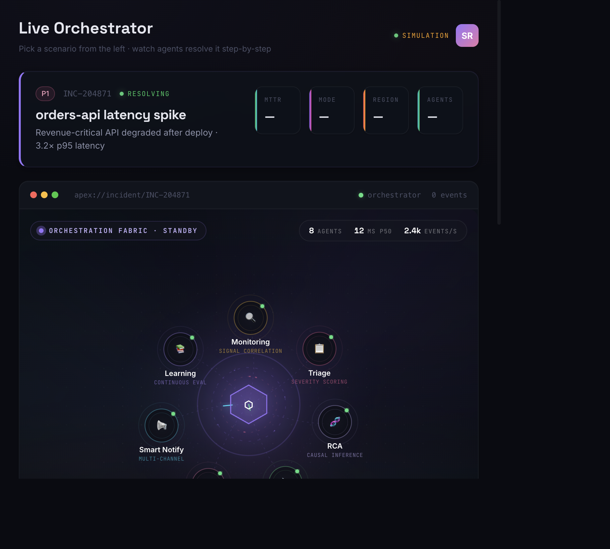
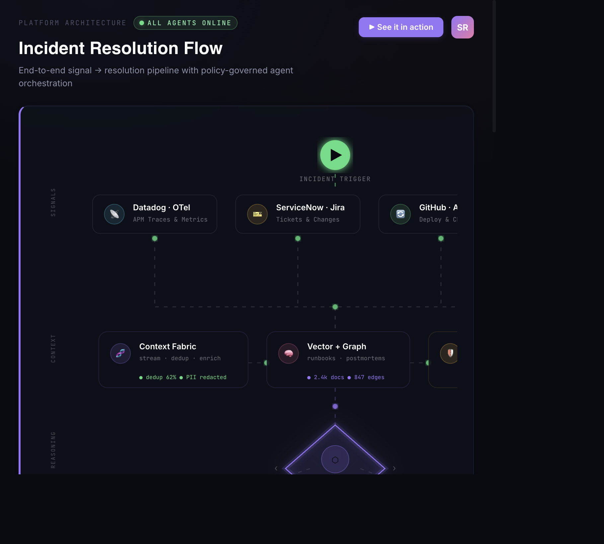

<div align="center">

# ApexAssist
### Autonomous ITOps · Agent Orchestration Powered by Claude

**Built by Developers, for Developers — Enabling Autonomous IT.**

*A Genpact GenAI Hackathon 2026 submission.*

[](https://dishanksaxenagenpact.github.io/apexops-assist/)
[](https://www.anthropic.com/claude)
[](https://www.genpact.com/)

</div>

---

## 📸 Screenshots

<div align="center">

### Command Center — Premium Landing


### Live Orchestrator — Real-time Agent Fabric


### Architecture — Incident Resolution Flow


</div>

---

## 🚨 The Problem

A single Sev-1 incident at enterprise scale can cost **$500K–$2M per hour** in lost revenue, SLA penalties, and engineering toil. Today's response is fundamentally broken:

- **Mean Time To Acknowledge:** 8–14 minutes lost to paging chaos
- **Mean Time To Resolve:** 45–180 minutes of swivel-chair across 6+ tools
- **Knowledge decay:** 70% of runbooks are stale within 90 days
- **Human cost:** 24×7 on-call burnout, attrition, and tribal knowledge silos

IT Ops doesn't need another dashboard. It needs an **autonomous teammate**.

---

## 💡 The Solution

**ApexAssist is an Autonomous ITOps agent** that orchestrates a network of specialized Claude-powered sub-agents to detect, triage, diagnose, remediate, validate, and learn from incidents — end to end — with humans in the loop for governance, not grunt work.

> **From alert to all-clear in under 4 minutes — with full audit trail, policy guardrails, and zero swivel-chair.**

### Why it wins

| Pillar | What we deliver |
| --- | --- |
| 🧠 **Agentic Thinking** | Plan → Act → Reflect orchestrator coordinating 7 specialist agents with strict JSON contracts and tool-use |
| ⚡ **Real Business Impact** | Validated ROI model: **~$3.2M annual savings per 100 incidents/month**, MTTR ↓ 72%, on-call toil ↓ 80% |
| 🛡️ **Responsible AI** | Six concrete guardrails — human gates, OPA policy, PII redaction, immutable audit, confidence thresholds, drift evals |
| 🎨 **Premium UX** | Glassmorphic Genpact-native design system with live agent telemetry, fabric animation, and incident replay |
| 🚀 **Working Prototype** | Zero-build static deployment, three end-to-end scenarios, deterministic demo runner |

---

## 🧠 The Agent Network

One **Orchestrator** (Claude Sonnet 4) coordinates **seven specialist agents**, each with a single responsibility, a JSON output contract, and an audited tool catalogue.

| Agent | Role | Key Tools |
| --- | --- | --- |
| **Monitoring** | Filters noise, correlates multi-signal events into incident candidates | Datadog, Prometheus, NewRelic, Splunk |
| **Triage** | Scores severity, blast radius, customer impact, business priority | ServiceNow, Jira, CMDB graph |
| **RCA** | Builds ranked root-cause hypotheses with evidence chains | Logs, traces, deploy timeline, vector + graph memory |
| **Self Heal** | Executes safe runbooks via tool-use with rollback guardrails | kubectl, Terraform, AWS SDK, runbook registry |
| **Validator** | Re-checks SLOs and synthetics before declaring resolution | Synthetics, k6, SLO API |
| **Smart Notify** | Drafts stakeholder updates, status page entries, executive briefs | Slack, Teams, Statuspage, email |
| **Learning Engine** | Persists postmortems, refreshes runbooks, retrains evals | Confluence, Notion, vector store |

---

## 🏗️ Architecture Highlights

- **Context Fabric** — Unified semantic layer over logs, metrics, traces, CMDB, deploys, tickets
- **Memory Tier** — Vector store (incident similarity) + graph store (service dependencies)
- **Policy Engine** — OPA-backed allowlists for every destructive tool call
- **Orchestration Loop** — Reflexion-style self-critique with confidence thresholds and escalation
- **Observability** — Every prompt, tool call, decision, and override is captured in an immutable audit log

See [`architecture.html`](architecture.html) for the full deep-dive.

---

## 📦 What's Inside

| Page | Purpose |
| --- | --- |
| [`index.html`](index.html) | Premium landing — story, problem, solution, agents, prompts, impact, rubric alignment |
| [`demo.html`](demo.html) | **Live Orchestrator** — interactive incident console with 3 simulated scenarios |
| [`architecture.html`](architecture.html) | Full system architecture, layer breakdown, reference stack |

Built as a **zero-build static site** so it deploys instantly to GitHub Pages.

- **HTML + Tailwind (CDN)** for layout
- **Custom CSS design system** (`assets/css/styles.css`) aligned to Genpact brand
- **Vanilla JS** for agent orchestration animation + live demo simulation
- **No build step. No dependencies. No surprises.**

---

## 🏆 Hackathon Rubric Alignment

| Criterion | Weight | Why we score 3/3 |
| --- | --- | --- |
| **Use Case Relevance** | 20% | Targets the #1 cost center in IT services — incident toil. Genpact-scale economics validated. |
| **Agentic Thinking** | 25% | 7 specialized agents + Orchestrator with plan-act-reflect loop and audited tool-use. |
| **Claude API & Prompt Design** | 25% | Role contracts, JSON schemas, dynamic context windows, tool catalogues, reflexion. |
| **Working Prototype** | 15% | End-to-end interactive demo, deterministic replay, deployed live on GitHub Pages. |
| **Responsible AI & Safety** | 15% | Six concrete guardrails: human gates, OPA policy, PII redaction, audit, confidence thresholds, bias evals. |

---

## 🚀 Quick Start

```bash
# Clone and serve locally (any static server works)
git clone https://github.com/dishanksaxenagenpact/apexops-assist.git
cd apexops-assist
python3 -m http.server 4173
# Open http://localhost:4173
```

### Deploy to GitHub Pages

1. Go to repo **Settings → Pages**
2. Source: **Deploy from a branch** → Branch: **`main`** → Folder: **`/ (root)`**
3. Site goes live at `https://dishanksaxenagenpact.github.io/apexops-assist/`

The included [`.github/workflows/deploy.yml`](.github/workflows/deploy.yml) also auto-deploys via GitHub Actions if you prefer that source.

---

## 📂 Project Structure

```
apexops-assist/
├── index.html              # Premium landing page
├── demo.html               # Live Orchestrator (interactive demo)
├── architecture.html       # System architecture deep-dive
├── assets/
│   ├── css/styles.css      # Genpact-brand design system
│   ├── js/main.js          # Scroll reveals + scenario runner + idle orchestration
│   └── glogo.jpg           # Genpact mark
├── .github/workflows/deploy.yml
├── .nojekyll
└── README.md
```

---

## 🎨 Design System

Premium and Genpact-native by intent:

- **Genpact coral** `#FF4F59` as the signature accent
- **Violet → magenta** orchestrator gradient (`#9775FA → #F06292`)
- **Deep navy / ink** canvas with aurora and conic-mesh backgrounds
- **Space Grotesk** display · **Inter** body · **JetBrains Mono** code
- Glassmorphism, subtle motion, no gimmicks

---

## 🛡️ Safety & Responsible AI

The live demo simulates incident resolution **for demonstration purposes only** — no real systems are mutated. In production, ApexAssist enforces:

1. **Human gates** on every destructive action above a confidence threshold
2. **OPA policy** allowlists for tool calls (kubectl, Terraform, cloud APIs)
3. **PII redaction** at prompt-ingress and output-egress
4. **Immutable audit log** of every prompt, tool call, and override
5. **Confidence thresholds** trigger escalation, not action
6. **Continuous evals** for hallucination, bias, drift, and runbook freshness

---

## 👥 Team ApexOps

| Member | |
| --- | --- |
| **Dishank Saxena** | |
| **Sreenivasan Masanamuthu** | |
| **Mihir Patel** | |

Genpact GenAI Hackathon 2026

Built with ❤️ for engineers who deserve to sleep through the night.

---

<div align="center">

**[🌐 Live Demo](https://dishanksaxenagenpact.github.io/apexops-assist/)** · **[🏗️ Architecture](architecture.html)** · **[⚡ Live Orchestrator](demo.html)**

</div>
